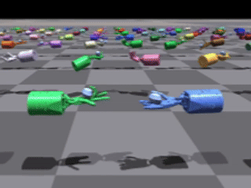

# M3W: MoE-based World Model for Multi-Task Multi-Agent RL


## Ovewview

**M3W** is a Mixture-of-Experts world model framework for multi-task multi-agent reinforcement learning.


M3W leverages the idea of **bounded similarity** in task dynamics, combining **SoftMoE dynamics learning** and **SparseMoE reward prediction** within a world model. By planning directly on predicted rollouts with a **multi-agent MPPI planner**, it enables efficient knowledge reuse, conflict avoidance, and scalable multi-task adaptability, surpassing policy-centric approaches.


<!-- ### 📑 Table of Contents
1. [Installation](#installation)  
2. [Quick Start](#quick-start)  
3. [Results](#results)  
4. [Acknowledgement & Citation](#acknowledgement--citation) -->

---
## ⚙️ Installation
```bash
conda create -n m3w python=3.8 -y
conda activate m3w
pip install -r requirements.txt
```
If you encounter issues when installing **MA-MuJoCo**, **Isaac Gym** or **Bi-DexHands**, please refer to [MA-MuJoCo](https://github.com/schroederdewitt/multiagent_mujoco), [Isaac Gym](https://developer.nvidia.com/isaac-gym) and [Bi-DexHands](https://github.com/PKU-MARL/DexterousHands).

## 🚀 Quick Start
For training, please run:
```bash
python examples/train.py --load_config configs/mujoco/installtest/m3w/config.json
```
You can modify the configuration in `configs/mujoco/installtest/m3w/config.json` to customize the training process.

We extend Bi-DexHands to multi-task settings using multiprocessing, which makes the sampling process significantly slower. To accelerate training, you can refer to the settings in [shadow_hand_meta settings](https://github.com/PKU-MARL/DexterousHands/tree/main/bidexhands/tasks/shadow_hand_meta) and enable GPU-based parallel multi-task execution.


## 📈 Results

M3W achieves superior performance on both Bi-DexHands and MA-MuJoCo, showing superior sample efficiency and multi-task adaptability compared to policy-centric baselines.


## 🎥 Demos
Here we showcase several representative task rollouts demonstrating the diverse cooperative behaviors learned by M3W.

#### Bi-DexHands
<p align="center">
  
  
  
  
</p>

</p>
<p align="center">
  
  
  
  
</p>

#### MA-Mujoco
<p align="center">
  
  
  
  
</p>

## 🙏 Acknowledgement & 📜 Citation
Our code is built upon [HARL](https://github.com/PKU-MARL/HARL), [TDMPC2](https://github.com/nicklashansen/tdmpc2) and [Light-SoftMoE](https://github.com/zhaozijie2022/soft-moe). We thank all these authors for their nicely open sourced code and their great contributions to the community.

If you find our research helpful and would like to reference it in your work, please consider the following citations:

```bibtex
@inproceedings{zhao2025m3w,
  title     = {Learning and Planning Multi-Agent Tasks via a MoE-based World Model},
  author    = {Zhao, Zijie and Zhao, Zhongyue and Xu, Kaixuan and Fu, Yuqian and Chai, Jiajun and Zhu, Yuanheng and Zhao, Dongbin},
  booktitle = {},
  year      = {2025}
}
```